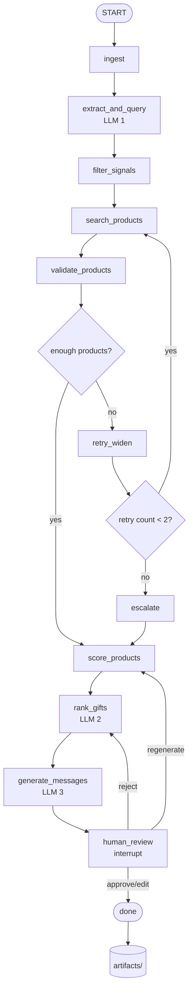

# Gift Agent

An AI workflow that takes a LinkedIn-style contact profile and returns three personalised, purchasable gift recommendations — with grounded reasoning, real product URLs, deterministic confidence scores, and a human review step before the output is finalised.

**Demo:** [Watch on Google Drive](https://drive.google.com/file/d/1UAZwce1O1i1p2qP_XcWevORRSpbOCjNd/view?usp=sharing)

---

## Table of Contents

- [Overview](#overview)
- [How it works](#how-it-works)
- [Workflow diagram](#workflow-diagram)
- [Each node explained](#each-node-explained)
- [LLM provider setup](#llm-provider-setup)
- [Project structure](#project-structure)
- [Input schema](#input-schema)
- [Output schema](#output-schema)
- [Running the project](#running-the-project)
- [Web UI walkthrough](#web-ui-walkthrough)
- [CLI usage](#cli-usage)
- [API reference](#api-reference)
- [Artifacts and saved output](#artifacts-and-saved-output)
- [How confidence is calculated](#how-confidence-is-calculated)
- [Validation rules](#validation-rules)
- [Safety filter](#safety-filter)
- [Relationship scoring](#relationship-scoring)
- [Signal to product mapping](#signal-to-product-mapping)
- [Sample contacts](#sample-contacts)
- [Running tests](#running-tests)
- [Tech stack](#tech-stack)

---

## Overview

The system reads a contact's LinkedIn profile — their posts, comments, headline, experience, and engaged topics — and extracts gifting signals that are grounded in exact profile quotes. It then searches for real products on Indian e-commerce platforms, scores them using a deterministic formula, and asks an LLM to pick the top 3 and write personalised reasoning for each. A human reviewer then approves, rejects, edits, or asks for regeneration before anything is finalised.

The key principles throughout:

- Every signal is backed by an exact quote from the profile. Nothing is inferred without evidence.
- Product URLs come from search results only. No LLM constructs or guesses a URL.
- Confidence scores are computed by a fixed formula in Python. No LLM touches them.
- The safety filter is a deterministic keyword blocklist. Not an LLM judgment.
- All run artifacts are saved as JSON for a complete audit trail.

---

## How it works

The workflow runs as a LangGraph pipeline. Contact JSON goes in at one end. Reviewed, approved recommendations come out the other end. In between, 11 nodes handle extraction, filtering, search, validation, scoring, ranking, message generation, and human review.

Three nodes make LLM calls. The rest are deterministic Python.

```
contact JSON
     ↓
  ingest
     ↓
  extract_and_query  ← LLM #1
     ↓
  filter_signals
     ↓
  search_products
     ↓
  validate_products
     ↓
  [enough products?]
     ├─ yes → score_products
     └─ no  → retry_widen → [retry < 2?]
                   ├─ yes → search_products (loop)
                   └─ no  → escalate → score_products
     ↓
  rank_gifts  ← LLM #2
     ↓
  generate_messages  ← LLM #3
     ↓
  human_review  [interrupt — waits for reviewer action]
     ├─ approve → done
     ├─ edit    → done
     ├─ reject  → rank_gifts (re-rank with rejection history)
     └─ regenerate → score_products (re-score + re-rank)
     ↓
  done → artifacts/
```

---

## Workflow diagram



---

## Each node explained

### ingest
Validates the contact JSON against Pydantic models. Normalises the budget (swaps min/max if inverted). Extracts `relationship_type` to the top level of state for use in scoring. Generates a unique `thread_id` for this run. Flattens the LinkedIn profile into a single text block that the LLM will read.

### extract_and_query — LLM #1
Single LLM call. Reads the flattened profile text and produces three things in one JSON response:
- `evidence_map` — maps every signal to exact quotes from the profile
- `strong_signals` — things explicitly stated in the profile
- `weak_signals` — reasonable professional inferences
- `queries` — initial search query ideas (typed as strong/weak/fallback)

The LLM is instructed to only extract signals that appear explicitly in the profile and to ground each one in a quote. Signals like "ML Infrastructure focus" or "passionate about open source" that cannot map to a real purchasable product are explicitly discouraged by the prompt.

Retries up to 2 times on JSON parse or schema validation failure. Falls back to empty signals with a role-based generic query if all attempts fail.

### filter_signals
Pure Python. No LLM. Checks every signal string against a keyword blocklist across six sensitive categories:

- `religion` — temple, mosque, church, hindu, muslim, christian, sikh, jain, puja, namaz, halal, kosher, vegetarian, diwali, and 20+ others
- `health` — cancer, diabetes, diet, weight, therapy, medication, mental health, depression, and 15+ others
- `politics` — BJP, Congress, election, vote, protest, and 10+ others
- `ethnicity` — caste, brahmin, dalit, obc, tribal, and 15+ others
- `gender` — wife, husband, girlfriend, feminine, masculine, and 10+ others
- `family_status` — married, divorced, children, pregnant, parent, and 15+ others

Short keywords (3 chars or fewer) use word-boundary matching to avoid false positives. Longer keywords use substring matching.

Signals that hit the blocklist are removed and logged in `signals_to_avoid` with the category and reason. Borderline signals (coffee, wine, fitness, running) are kept but flagged in a separate `borderline` list for reviewer awareness. The cleaned evidence map removes entries for dropped signals.

### search_products
Takes the safe signals and role from state, passes them through `signal_to_product.py` (a deterministic mapping layer), and runs DuckDuckGo searches. Does not use LLM-generated queries from `extract_and_query` — uses the product mapping layer instead, which translates abstract signals into concrete searchable product terms.

On retry (after `retry_widen`), uses only weak/fallback queries with the widened budget.

Results are deduplicated by URL. Maximum 15 total results across all queries. Preferred Indian e-commerce domains (amazon.in, flipkart.com, myntra.com, etc.) are sorted to the front.

### validate_products
Applies 6 weighted rules to each raw search result. Computes a `validation_score` as a weighted sum and assigns a `validation_tier` of pass, partial, or fail.

Full details in the [Validation rules](#validation-rules) section below.

Products scoring below 0.40 are hard-rejected and excluded from scoring. Products between 0.40 and 0.75 are partial and can proceed. Products above 0.75 pass.

### retry_widen
Triggered when fewer than 3 products pass or partially pass validation. Increments `retry_count`, multiplies `budget_max` by 1.10, adds new weak/fallback queries with the wider budget, and clears `raw_results` and `validated_products` so the next search run is fresh. The graph loops back to `search_products`.

Maximum 2 retries. If `retry_count` reaches 2, the graph routes to `escalate` instead.

### escalate
Takes the best available products regardless of validation tier (including fail-tier as last resort if needed). Sets `escalation_flag = True`. Writes `escalation_notes` explaining how many retries were attempted, how many products were found, and what the common failure reasons were. The workflow continues to `score_products` with whatever is available, and the escalation flag surfaces prominently in the review UI.

### score_products
Deterministic Python. No LLM. Computes five sub-scores per product and combines them into a `confidence` value using fixed weights. Assigns `risk_level` based on confidence thresholds. Sorts all products by confidence descending.

Full formula in the [How confidence is calculated](#how-confidence-is-calculated) section.

### rank_gifts — LLM #2
Receives the sorted `scored_products` list, `safe_signals`, `evidence_map`, and `review_history` (if any previous rejections). Picks the top 3 and writes:
- `why_this_gift` — explanation of the fit
- `personalisation_reasoning` — which profile signals were used
- `evidence_citations` — exact quotes from `evidence_map`
- `assumptions` — anything inferred beyond direct evidence

The LLM cannot change `confidence` or `risk_level` — these are copied from `scored_products` in code. The LLM cannot modify or construct URLs — the matching logic in `rank_gifts.py` takes the URL from `scored_products` and copies it, ignoring whatever URL the LLM may have written.

If `review_history` contains past rejections, the LLM reads the rejection reasons and avoids previously flagged products.

Falls back to top-3-by-confidence if LLM fails, with a note that manual reasoning was unavailable.

### generate_messages — LLM #3
Receives the 3 ranked gifts, the contact details, the `evidence_map`, and the tone determined from relationship type and occasion. Generates a short personalised gift message (2–4 sentences) for each gift. Messages must be grounded in the evidence map — no new signals can be introduced.

Tone is determined by relationship type: `professional` for executives and prospective customers, `warm` for existing customers, founders, and partners, `casual` for colleagues.

After messages are generated, the full `final_recommendations` dict is assembled matching the assignment output schema exactly.

### human_review
Calls `langgraph.interrupt()` which pauses the graph completely. The current state becomes available via `GET /status/{thread_id}`. The reviewer acts via `POST /review/{thread_id}` with one of four actions:

- `approve` — routes to `done`, saves output, auto-downloads JSON in UI
- `reject` — stores rejection reason in `review_history`, routes back to `rank_gifts` which re-ranks reading the history
- `edit` — applies an inline field edit to a specific gift (editable fields: `gift_name`, `why_this_gift`, `personalisation_reasoning`, `personalised_message`, `assumptions`, `estimated_price`), routes to `done`
- `regenerate` — stores notes in `review_history`, routes back to `score_products` which re-scores and re-ranks

Every review action is recorded in `review_history` with the action, reason, notes, flagged gift ranks, and a timestamp. This persists across all review cycles in the same run.

### done
Updates `human_review.status` to approved/edited/rejected/regenerated. Attaches `review_history` and workflow logs to the output. Saves all artifacts to `artifacts/{thread_id}/`. Logs total latency, total tokens, total LLM calls across the run.

---

## LLM provider setup

Three providers supported. The system checks them in order and uses the first available one:

**1. Ollama + Qwen3 — primary, fully local, no API key**

```bash
# macOS/Linux
curl -fsSL https://ollama.ai/install.sh | sh
ollama pull qwen3
ollama serve
```

Windows: download from https://ollama.ai/download, then `ollama pull qwen3`

**2. Groq — fallback #1, free tier**

Get a free key at https://console.groq.com. Add to `.env`:
```
GROQ_API_KEY=your_key_here
```
Model used: `llama-3.3-70b-versatile`

**3. Gemini Flash — fallback #2, free tier**

Get a free key at https://aistudio.google.com. Add to `.env`:
```
GEMINI_API_KEY=your_key_here
```
Model used: `gemini-1.5-flash`

The project runs entirely with just Ollama. Groq is significantly faster for testing (5–10s per LLM call vs 60–90s for Qwen3 locally).

---

## Project structure

```
gift-agent/
│
├── agent/
│   ├── graph.py                  LangGraph StateGraph — nodes, edges, conditionals
│   ├── state.py                  GiftAgentState TypedDict — every state field documented
│   └── nodes/
│       ├── ingest.py             Node 1 — validate, normalise, initialise state
│       ├── extract_and_query.py  Node 2 — LLM #1, evidence map + signals
│       ├── filter_signals.py     Node 3 — keyword blocklist, no LLM
│       ├── search_products.py    Node 4 — DuckDuckGo via signal_to_product mapping
│       ├── validate_products.py  Node 5 — 6 weighted rules
│       ├── score_products.py     Node 6 — deterministic confidence formula
│       ├── rank_gifts.py         Node 7 — LLM #2, top 3 with reasoning
│       ├── generate_messages.py  Node 8 — LLM #3, personalised gift notes
│       ├── human_review.py       Node 9 — LangGraph interrupt + action routing
│       ├── retry_widen.py        Retry branch — budget x1.10, new queries
│       └── escalate.py           Escalation branch — best available + flag
│
├── prompts/
│   ├── extract_and_query.py      System + user prompt for LLM #1
│   ├── rank_gifts.py             System + user prompt for LLM #2
│   └── generate_messages.py      System + user prompt for LLM #3
│
├── models/
│   ├── contact.py                ContactInput, GiftContext, RelationshipContext, LinkedInProfile
│   ├── signals.py                ExtractedSignals, SafeSignals, FilteredSignal, SearchQuery
│   ├── products.py               RawProduct, ValidatedProduct, ScoredProduct, ProductScores
│   └── recommendations.py        RankedGift, FinalRecommendation, ReviewEntry
│
├── services/
│   ├── signal_to_product.py      Deterministic signal → product category mapping
│   ├── search.py                 DuckDuckGo wrapper with exponential backoff retry
│   └── llm/
│       ├── base.py               LLMProvider abstract base class
│       ├── factory.py            Auto-fallback provider selection, module-level singleton
│       ├── ollama_provider.py    HTTP to localhost:11434/api/chat
│       ├── groq_provider.py      groq SDK, llama-3.3-70b-versatile
│       └── gemini_provider.py    google-generativeai SDK, gemini-1.5-flash
│
├── utils/
│   ├── pricing.py                Price extraction from text — ₹, Rs., INR, Indian number format
│   ├── validation.py             URL reachability, trusted domain check, product URL pattern
│   └── logging.py                Per-node structured logging helpers
│
├── api/
│   ├── app.py                    FastAPI app, CORS, static files, startup logging
│   └── routes/
│       ├── run.py                POST /run
│       ├── review.py             POST /review/{thread_id}
│       └── status.py             GET /status/{thread_id}, GET /runs
│
├── storage/
│   └── artifact_store.py         Atomic JSON writes for all run artifacts
│
├── ui/
│   └── index.html                Single-file review UI, vanilla JS, no build step
│
├── data/
│   ├── sample_input.json         Single contact — Aarav Mehta
│   ├── sample_contacts.json      7 diverse contacts for testing
│   └── sample_output.json        Expected output in assignment schema
│
├── tests/
│   ├── test_ingest.py            9 tests
│   ├── test_filter_signals.py    12 tests
│   ├── test_score_products.py    16 tests
│   ├── test_validate_products.py 16 tests
│   ├── test_relationship_scoring.py  11 tests
│   └── fixtures/
│       ├── sample_contacts.json
│       └── sample_products.json
│
├── artifacts/                    Auto-created at runtime, one folder per run
├── .env.example
├── requirements.txt
└── main.py                       CLI entrypoint
```

---

## Input schema

```json
{
    "name": "Rohan Kapoor",
    "role": "Founder and CEO",
    "company": "BuildFast AI",
    "location": "Mumbai, India",
    "linkedin_profile": {
      "headline": "Founder at BuildFast AI | YC W24 | Making AI accessible for SMBs",
      "about": "Building the operating system for small businesses using AI. Previously product at Google. Love chess and long-form reading.",
      "experience": [
        {
          "title": "Founder and CEO",
          "company": "BuildFast AI",
          "description": "YC W24. Raised $2M seed. Building AI workflow automation for SMBs."
        },
        {
          "title": "Senior Product Manager",
          "company": "Google",
          "description": "Led product for Google Pay India merchant side."
        }
      ],
      "recent_posts": [
        "Six months since YC batch — here is what I got wrong about product-market fit.",
        "Playing chess has made me a better founder. Pattern recognition is everything.",
        "Just finished Zero to One by Peter Thiel for the third time. Still finding new things."
      ],
      "recent_comments": [
        "The distribution problem is always harder than the product problem.",
        "Endgame chess is pure logic — no intuition, just calculation."
      ],
      "engaged_topics": [
        "Chess",
        "Startups",
        "AI products",
        "Product management",
        "Long-form reading"
      ]
    },
    "relationship_context": {
      "relationship_type": "Partner",
      "last_interaction": "Co-hosted a webinar together last month",
      "business_goal": "Strengthen partnership for joint GTM"
    },
    "gift_context": {
      "occasion": "Partnership appreciation",
      "budget_min": 2000,
      "budget_max": 5000,
      "currency": "INR",
      "country": "India"
    }
  }
```

All fields except `name` have defaults. `budget_min` and `budget_max` are normalised at ingest (min/max swapped if inverted). `relationship_type` accepts natural language values like "Prospective customer" or "existing customer" and is normalised to a standard key.

---

## Output schema

```json
{
  "contact_name": "Rohan Kapoor",
  "profile_signals": {
    "strong_signals": [
      "interested in chess",
      "enjoys long-form reading",
      "reads business strategy books"
    ],
    "weak_signals": [],
    "signals_to_avoid": [
      "Do not infer religion, politics, health, ethnicity, gender, family status, or other sensitive personal attributes"
    ]
  },
  "search_trace": {
    "queries_used": [
      "chess set premium site:amazon.in under 5000 rupees",
      "strategy board game site:flipkart.com under 5000 rupees",
      "business book bestseller site:amazon.in under 5000 rupees",
      "leadership book gift site:amazon.in under 5000 rupees",
      "leather notebook premium site:amazon.in under 5000 rupees",
      "luxury pen set site:amazon.in under 5000 rupees",
      "premium professional gift site:amazon.in under 5000 rupees"
    ],
    "products_considered_count": 15
  },
  "recommended_gifts": [
    {
      "rank": 1,
      "gift_name": "ChessBase India Premium Chess Set (Green), Kids",
      "product_url": "https://www.amazon.in/ChessBase-India-Premium-Chess-Green/dp/B09RFXCPZS",
      "store": "Amazon.in",
      "estimated_price": "Price on product page",
      "why_this_gift": "This gift is suitable because the contact has expressed interest in chess, as evident from the statement 'Love chess'. The ChessBase India Premium Chess Set is a high-quality product that aligns with the contact's interest.",
      "personalisation_reasoning": "The contact's interest in chess is a strong signal, as seen in the evidence map with quotes such as 'Love chess' and 'Playing chess has made me a better founder. Pattern recognition is everything.'",
      "personalised_message": "Mr. Rohan Kapoor, I am pleased to offer this ChessBase India Premium Chess Set as a symbol of our partnership's strategic growth, reflecting your appreciation for the game of chess and its impact on your approach to founding BuildFast AI.",
      "confidence_score": 0.86,
      "risk_level": "low",
      "assumptions": [
        "The contact values high-quality products"
      ]
    },
    {
      "rank": 2,
      "gift_name": "BHARATA 600 BC Strategy & War Board Game - Flipkart",
      "product_url": "https://www.flipkart.com/goindia-games-bharata-600-bc-strategy-war-board-game/p/itmd92f3f97ad901",
      "store": "Flipkart",
      "estimated_price": "Price on product page",
      "why_this_gift": "This gift is suitable because the contact enjoys long-form reading and reads business strategy books, as seen in the evidence map. The BHARATA 600 BC Strategy & War Board Game is a strategy game that aligns with the contact's interests.",
      "personalisation_reasoning": "The contact's interest in business strategy books, such as 'Zero to One by Peter Thiel', suggests that they value strategic thinking. The BHARATA 600 BC Strategy & War Board Game is a product that caters to this interest.",
      "personalised_message": "Mr. Rohan Kapoor, as someone who values long-form reading and business strategy, I believe you will appreciate the BHARATA 600 BC Strategy & War Board Game, which combines these interests in a unique and engaging way, much like your thoughtful approach to business and partnership.",
      "confidence_score": 0.86,
      "risk_level": "low",
      "assumptions": [
        "The contact enjoys strategy games"
      ]
    },
    {
      "rank": 3,
      "gift_name": "TRIFECTA Business Game with Money Notes - Fun Board Game for ...",
      "product_url": "https://www.flipkart.com/trifecta-business-game-money-notes-fun-board-young-businessmen-strategy-war-games/p/itmccbcf3e532d22",
      "store": "Flipkart",
      "estimated_price": "Price on product page",
      "why_this_gift": "This gift is suitable because the contact reads business strategy books and enjoys long-form reading. The TRIFECTA Business Game with Money Notes is a product that aligns with the contact's interests in business and strategy.",
      "personalisation_reasoning": "The contact's interest in business strategy books and long-form reading suggests that they value products that simulate real-world business scenarios. The TRIFECTA Business Game with Money Notes is a product that caters to this interest.",
      "personalised_message": "Mr. Rohan Kapoor, in recognition of our partnership and your interest in business strategy, I am delighted to present the TRIFECTA Business Game with Money Notes, a gift that aligns with your enjoyment of business strategy books and long-form reading, reflecting our shared commitment to strategic growth and partnership.",
      "confidence_score": 0.86,
      "risk_level": "low",
      "assumptions": [
        "The contact values interactive business simulations"
      ]
    }
  ],
  "human_review": {
    "status": "pending_review",
    "available_actions": [
      "approve",
      "reject",
      "edit",
      "regenerate"
    ]
  }
}
```

---

## Running the project

```bash
# Clone
git clone https://github.com/TejasCThakare/gift-agent.git
cd gift-agent

# Python environment
python3 -m venv .venv
source .venv/bin/activate

# Install dependencies
pip install -r requirements.txt
pip install ddgs

# Environment config
cp .env.example .env
# Open .env and add GROQ_API_KEY if using Groq

# Start Ollama (if using local LLM)
ollama serve
# In a separate terminal: ollama pull qwen3

# Start the server
uvicorn api.app:app --reload --port 8000
```

Open http://localhost:8000

Health check to confirm LLM providers:
```bash
curl http://localhost:8000/health
```

---

## Web UI walkthrough

Open http://localhost:8000

**Step 1 — Load a contact**

Click **Load Sample** to load the Aarav Mehta sample contact, or paste any contact JSON directly into the text area.

**Step 2 — Run the workflow**

Click **Run Workflow**. The pipeline runs — ingest, signal extraction, safety filtering, search, validation, scoring, ranking, message generation — and the results appear when it reaches the human review interrupt. Takes 30–90 seconds depending on the LLM provider.

**Step 3 — Review the output**

The UI shows:
- Profile signals extracted (strong, weak, borderline, dropped)
- Evidence map (collapsible) — exact profile quotes behind each signal
- Search trace (collapsible) — queries used, products found, validation scores and tiers
- Three gift recommendations with confidence score, risk level, reasoning, evidence citations, and personalised message
- Review history if this is a re-run after a previous rejection

**Step 4 — Take an action**

- **Approve** — confirms the recommendations, saves final output to `artifacts/`, auto-downloads the output JSON
- **Reject** — requires a reason, re-ranks the gifts using the rejection reason as context
- **Edit** — pick a gift (1/2/3), pick a field, enter new text, saves immediately
- **Regenerate** — provide notes, re-scores and re-ranks with your notes as context

**Step 5 — Download output**

The **Download Output JSON** button appears as soon as results are ready. On approve it downloads automatically. The file matches the assignment output schema exactly.

Past runs are listed at the bottom of the page with thread ID, contact name, status, and timestamp.

---

## CLI usage

```bash
# Single contact, interactive review
python main.py --input data/sample_input.json

# Single contact, skip review (auto-approve)
python main.py --input data/sample_input.json --auto-approve

# All 7 sample contacts, save outputs to a folder
python main.py --input data/sample_contacts.json --bulk --output-dir results/
```

The CLI shows a Rich terminal UI with signals, recommendations, confidence scores, and personalised messages. Review actions are prompted interactively: `a` to approve, `r` to reject, `e` to edit, `g` to regenerate.

---

## API reference

| Method | Path | Description |
|---|---|---|
| POST | `/run` | Start workflow for a contact. Returns `thread_id` and review payload. |
| POST | `/review/{thread_id}` | Submit approve / reject / edit / regenerate. |
| GET | `/status/{thread_id}` | Get current workflow state for a run. |
| GET | `/runs` | List all past runs with status. |
| GET | `/health` | LLM provider availability check. |
| GET | `/docs` | Swagger UI. |

**POST /run**
```bash
curl -X POST http://localhost:8000/run \
  -H "Content-Type: application/json" \
  -d @data/sample_input.json
```

**POST /review/{thread_id} — approve**
```bash
curl -X POST http://localhost:8000/review/run_abc123 \
  -H "Content-Type: application/json" \
  -d '{"action": "approve"}'
```

**POST /review/{thread_id} — reject**
```bash
curl -X POST http://localhost:8000/review/run_abc123 \
  -H "Content-Type: application/json" \
  -d '{"action": "reject", "reason": "All three are books — try something more varied"}'
```

**POST /review/{thread_id} — edit**
```bash
curl -X POST http://localhost:8000/review/run_abc123 \
  -H "Content-Type: application/json" \
  -d '{
    "action": "edit",
    "edit_payload": {
      "gift_index": 0,
      "field": "personalised_message",
      "new_value": "Aarav, hope this finds you well — thought of you when I saw this."
    }
  }'
```

**POST /review/{thread_id} — regenerate**
```bash
curl -X POST http://localhost:8000/review/run_abc123 \
  -H "Content-Type: application/json" \
  -d '{"action": "regenerate", "notes": "Focus more on the cricket signal, avoid books"}'
```

---

## Artifacts and saved output

Every run saves the following to `artifacts/{thread_id}/`:

| File | Contents |
|---|---|
| `recommendations.json` | Final output in the assignment output schema |
| `trace.json` | Evidence map, signals, safe signals, queries, raw results, validated products, scored products, retry count, escalation flag |
| `review_history.json` | All review actions with action type, reason, notes, flagged gift ranks, timestamps |
| `logs.json` | Per-node latency in ms, tokens used, LLM call count, errors |
| `state.json` | Complete GiftAgentState snapshot |

Writes are atomic — a `.tmp` file is written and renamed so partial writes never corrupt an artifact.

---

## How confidence is calculated

`score_products` is pure Python. The formula never changes. LLMs receive the result as read-only context.

Five sub-scores are computed per product:

**signal_score** — does the product title/snippet match any safe signal?
- Matches a strong signal → 1.0
- Matches a weak or borderline signal → 0.5
- No match → 0.0

**budget_score** — is the extracted price within the requested budget?
- Within budget_min to budget_max → 1.0
- Within 10% above budget_max → 0.6
- More than 10% over → 0.0
- Price unknown → 0.5 (benefit of doubt)

**country_score** — is this an India-specific product?
- `.in` domain or known Indian e-commerce domain → 1.0
- India or ₹ mentioned in snippet → 0.7
- Neither → 0.0

**search_quality_score** — what type of query found this product?
- Strong signal query → 1.0
- Weak signal query → 0.7
- Fallback query → 0.5

**relationship_score** — base score from the relationship type lookup table (see below), adjusted by validation tier (-0.1 for partial, -0.3 for fail)

**Final confidence:**
```
confidence = signal_score    × 0.35
           + budget_score    × 0.25
           + country_score   × 0.20
           + search_quality  × 0.10
           + relationship    × 0.10
```

**Risk level:**
- confidence ≥ 0.75 → low
- confidence ≥ 0.50 → medium
- confidence < 0.50 → high

---

## Validation rules

Six rules are applied to every raw search result. Weights sum to 1.0.

| Rule | Weight | How it works |
|---|---|---|
| trusted_domain | 0.30 | Is the domain in the trusted Indian e-commerce list |
| url_reachable | 0.25 | HTTP HEAD request — skipped for trusted domains (bot protection), full credit given |
| product_url_pattern | 0.20 | Does URL contain `/dp/`, `/p/`, `/product/`, `/item/`, `/buy/`, or a product-like slug with a digit |
| price_detected | 0.10 | Price found in title/snippet via regex; 50% credit for trusted domains with product URLs |
| budget_fit | 0.10 | Extracted price within budget range; 50% credit if trusted domain but no price in snippet |
| india_fit | 0.05 | `.in` domain, known Indian e-commerce domain, or India/₹ in snippet |

Thresholds: pass ≥ 0.75 / partial ≥ 0.40 / fail < 0.40

**Trusted domains list:**
amazon.in, flipkart.com, myntra.com, nykaa.com, tatacliq.com, reliancedigital.in, croma.com, meesho.com, snapdeal.com, ajio.com, bewakoof.com, thesouledstore.com, firstcry.com, pepperfry.com, urbanladder.com, bigbasket.com, blinkit.com, purplle.com, boat-lifestyle.com, noise.com, crossword.in

URL reachability is skipped for trusted domains because Amazon and Flipkart block HEAD requests from non-browser user agents, and the HTTP check adds 5–10 seconds per product for no useful signal when the domain is already trusted.

---

## Safety filter

`filter_signals` is a deterministic Python blocklist. Six sensitive categories with keyword lists:

| Category | Examples of blocked keywords |
|---|---|
| religion | temple, mosque, church, mandir, hindu, muslim, christian, sikh, jain, puja, namaz, halal, kosher, vegetarian, diwali, eid, christmas, navratri |
| health | cancer, diabetes, diet, weight loss, therapy, medication, hospital, mental health, depression, anxiety, illness, disorder, allergy |
| politics | bjp, congress, aap, election, vote, politician, protest, liberal, conservative |
| ethnicity | caste, brahmin, dalit, obc, st, sc, tribal, community, ancestry |
| gender | wife, husband, girlfriend, boyfriend, feminine, masculine, gender, for a woman, for a man |
| family_status | married, divorced, children, kids, pregnant, parent, mother, father, newborn |

Single-character and short (≤3 char) keywords use word-boundary regex matching to prevent false positives — e.g. the keyword `st` in the ethnicity list won't match "interested" or "strongest".

Borderline signals (coffee, tea, fitness, running, wine, beer, alcohol) are kept but flagged in a separate `borderline` list. The reviewer sees them marked distinctly in the UI.

Dropped signals appear in `signals_to_avoid` in the output with the category and reason for each.

---

## Relationship scoring

`score_products` uses a deterministic lookup table. No LLM inference.

| Relationship type | Base score | Preferred categories | Avoided categories |
|---|---|---|---|
| existing_customer | 0.90 | Personal interest gifts, premium experiences, customised gifts, loyalty recognition | Generic corporate, overly cheap |
| executive | 0.85 | Premium minimal, luxury desk accessories, artisan products, experience vouchers | Cheap novelty, mass-market trinkets, overly casual |
| partner | 0.85 | Collaborative, shared value, premium professional | One-sided branding, overly personal |
| prospective_customer | 0.80 | Premium stationery, tech accessories, business books, experience vouchers, desk accessories | Overly personal, consumables, alcohol, health and wellness |
| founder | 0.80 | Mission-aligned, startup culture, thought leadership books, quality tools | Generic corporate, low effort |
| colleague | 0.70 | Team celebration, fun accessories, hobby gifts, casual professional | Overly expensive, too intimate, alcohol |
| unknown | 0.65 | Safe professional, universally appropriate, neutral | Anything personal or sensitive |

The `relationship_type` field in the contact is normalised at ingest. "Prospective customer", "prospect", and "lead" all map to `prospective_customer`. "Client", "customer", and "existing customer" all map to `existing_customer`. Unrecognised values fall back to `unknown`.

---

## Signal to product mapping

`services/signal_to_product.py` is a deterministic translation layer that sits between signal extraction and search. It converts abstract signals like "interested in machine learning" or "VP Sales role" into concrete searchable product terms like "data science book site:amazon.in" or "business book site:amazon.in".

This exists because LLMs extract meaningful signals but the signals themselves are not search queries. "ML Infrastructure focus" returned Wikipedia articles when searched directly. The mapping layer converts it to "mechanical keyboard site:amazon.in" or "tech book gift site:amazon.in" — things that actually exist as products.

The mapping covers:
- Sports: cricket, football, badminton, running, chess, cycling
- Technology: programming, ML/AI, cloud/infra, cybersecurity, hardware/IoT
- Books and learning: business books, conferences and speaking
- Music, photography, art and design
- Business roles: sales, founder, finance, marketing, product management
- Lifestyle: travel, coffee, tea, cooking, wellness, gaming, sustainability
- Roles: CTO, CEO, CFO, VP Sales, designer, data scientist, lawyer, teacher, journalist

If no signal matches, role-based fallback queries are used. A universal safe fallback (`premium professional gift site:amazon.in`) is always appended.

---

## Sample contacts

`data/sample_contacts.json` has 7 contacts covering different roles, interests, and relationship types:

| Name | Role | Key signals | Relationship |
|---|---|---|---|
| Aarav Mehta | VP Sales | Cricket, Challenger Sale book | Prospective customer |
| Priya Sharma | CTO | Python/ML, Kubernetes, open source | Existing customer |
| Rohan Kapoor | Founder/CEO | Chess, startup books, long-form reading | Partner |
| Neha Joshi | Head of Marketing | D2C marketing books, content strategy | Existing customer |
| Vikram Nair | Managing Director | Badminton, private equity | Prospective customer |
| Anjali Desai | Senior PM | Running, PM books | Colleague |
| Sameer Kulkarni | Director of Engineering | Guitar, system design | Executive |

---

## Running tests

```bash
pytest tests/ -v
```

69 tests total:

- `test_ingest.py` — validation, budget normalisation, state initialisation, thread ID handling
- `test_filter_signals.py` — blocklist correctness, word boundary matching, borderline flagging, evidence map cleaning
- `test_score_products.py` — confidence formula, weight sum, risk level thresholds, determinism, key term extraction
- `test_validate_products.py` — price extraction (₹, Rs., INR, lakh format), domain trust check, product URL pattern, India fit
- `test_relationship_scoring.py` — all 7 types present, scores in range, prefer/avoid lists populated

---

## Tech stack

| Component | Library / Tool |
|---|---|
| Workflow orchestration | LangGraph 0.2+ with MemorySaver checkpointer |
| LLM primary | Ollama (local) + Qwen3 |
| LLM fallback 1 | Groq SDK + llama-3.3-70b-versatile |
| LLM fallback 2 | google-generativeai + gemini-1.5-flash |
| Web search | ddgs (DuckDuckGo, no API key) |
| HTTP client | httpx |
| API framework | FastAPI + Uvicorn |
| Data validation | Pydantic v2 |
| Retry logic | tenacity |
| CLI | Typer + Rich |
| Testing | pytest |

---

## License

MIT