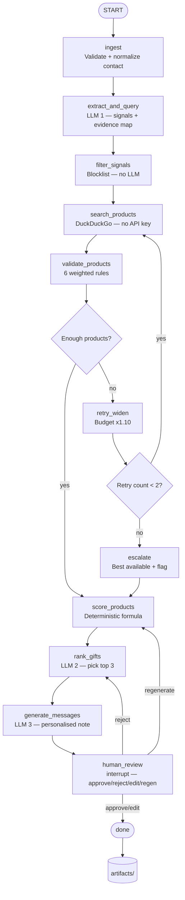

# Gift Agent — Hyper-Personalised AI Gift Recommendation System

> Built as part of an AI workflow engineering assignment. The goal was to take a LinkedIn-style contact profile and recommend 3 relevant, purchasable gifts with real product links, grounded reasoning, and a human review step before anything goes out.

**Demo video:** [Watch on Google Drive](#) ← replace with your link

---

## What this is

Most gift recommendation tools are generic. They take a job title and return "premium pen set" for everyone. That's not personalisation — that's a category filter.

This system actually reads the profile. If someone posts about cricket, it finds a cricket bat on Amazon. If they mention finishing *The Challenger Sale*, it suggests the companion book. Every recommendation is traced back to an exact quote from their profile — no guessing, no hallucination.

The workflow runs as a LangGraph pipeline with 11 nodes, 3 LLM calls, deterministic scoring, and a human-in-the-loop review step where you can approve, reject, edit, or regenerate before anything is finalised.

---

## Demo

Load the UI at `http://localhost:8000`, paste a contact JSON, click Run Workflow. Takes about 30–60 seconds end to end depending on your LLM provider.


---

## How it works — the full pipeline



### Node by node

| Node | LLM | What it does |
|---|---|---|
| `ingest` | No | Validates contact JSON, normalises budget, extracts relationship type |
| `extract_and_query` | Yes (#1) | Reads profile, produces evidence map mapping every signal to exact quotes |
| `filter_signals` | No | Keyword blocklist — drops religion, health, politics, gender, family status |
| `search_products` | No | Translates signals to product categories, searches DuckDuckGo |
| `validate_products` | No | 6 weighted rules per product, hard rejects articles and category pages |
| `score_products` | No | Deterministic confidence formula — LLMs cannot touch this |
| `rank_gifts` | Yes (#2) | Picks top 3 from scored list, writes grounded reasoning |
| `generate_messages` | Yes (#3) | Writes personalised gift note per gift, tone from relationship type |
| `human_review` | No | LangGraph interrupt — pauses for reviewer action |
| `retry_widen` | No | Widens budget 10%, shifts to fallback queries, retries search |
| `escalate` | No | After 2 failed retries — surfaces best available with low confidence flag |

---

## Architecture decisions worth knowing

**Why signals are grounded in evidence**

The `extract_and_query` LLM call produces an `evidence_map` — a dict that maps every extracted signal to a list of exact quotes from the profile. Downstream LLM calls (ranking, messages) are required to cite from this map. They cannot introduce signals that weren't in the evidence. This is the main anti-hallucination layer.

**Why confidence scores are deterministic**

The confidence formula runs in `score_products` — a pure Python node with no LLM. The formula is:

```
confidence = signal_score    × 0.35
           + budget_score    × 0.25
           + country_score   × 0.20
           + search_quality  × 0.10
           + relationship    × 0.10
```

The LLMs in `rank_gifts` and `generate_messages` receive confidence as read-only. They can explain it but cannot change it. This means the confidence numbers in the output are always reproducible and auditable.

**Why URLs are never LLM-generated**

All product URLs come from DuckDuckGo search results. The `rank_gifts` LLM selects from a pre-built list of scored products and copies the URL exactly. The prompt explicitly says "do not construct, modify or invent any URLs." The URL copying is enforced in code — `rank_gifts.py` matches the LLM's selection back to `scored_products` by title/URL and uses the stored URL, not whatever the LLM returned.

**Why the safety filter is not an LLM**

`filter_signals` is pure Python with keyword lists. It blocks signals touching religion, health, politics, ethnicity, gender, and family status. Using an LLM for this would introduce inconsistency and be unjustifiable in an audit. A deterministic blocklist is transparent, testable, and explainable.

**Why rejection doesn't go back to ingest**

When a reviewer rejects recommendations, the profile hasn't changed. Re-running ingest and search would waste 30+ seconds rediscovering the same products. Rejection routes to `rank_gifts` so the LLM re-ranks using the rejection reason stored in `review_history`. Regeneration routes to `score_products` if you want different products. Ingest only re-runs if you submit a completely new contact.

**Relationship scoring**

Every relationship type has an explicit scoring config in `RELATIONSHIP_SCORE_TABLE`:

| Type | Base score | Preference |
|---|---|---|
| existing_customer | 0.90 | Personal and premium |
| executive | 0.85 | Minimal, luxury, tasteful |
| partner | 0.85 | Collaborative, shared value |
| prospective_customer | 0.80 | Safe, professional, low-risk |
| founder | 0.80 | Mission-aligned, thoughtful |
| colleague | 0.70 | Casual professional |
| unknown | 0.65 | Safe universal default |

This is deterministic and in code — not hidden in a prompt.

---

## LLM providers

The system tries providers in this order and auto-selects the first available one:

```
1. Ollama + Qwen3   → local, no API key, free, ~4.7GB model
2. Groq             → free tier, fast, needs GROQ_API_KEY
3. Gemini Flash     → free tier, needs GEMINI_API_KEY
```

You can run the entire project with just Ollama — no external accounts needed. Groq is faster for testing (~5s vs ~60s per LLM call).

---

## Repository structure

```
gift-agent/
│
├── agent/
│   ├── graph.py                  LangGraph StateGraph — all nodes, edges, conditionals
│   ├── state.py                  GiftAgentState TypedDict — single source of truth
│   └── nodes/
│       ├── ingest.py
│       ├── extract_and_query.py  LLM #1
│       ├── filter_signals.py
│       ├── search_products.py
│       ├── validate_products.py
│       ├── score_products.py
│       ├── rank_gifts.py         LLM #2
│       ├── generate_messages.py  LLM #3
│       ├── human_review.py
│       ├── retry_widen.py
│       └── escalate.py
│
├── prompts/
│   ├── extract_and_query.py
│   ├── rank_gifts.py
│   └── generate_messages.py
│
├── models/
│   ├── contact.py                ContactInput, GiftContext, RelationshipContext
│   ├── signals.py                ExtractedSignals, SafeSignals, EvidenceMap
│   ├── products.py               RawProduct, ValidatedProduct, ScoredProduct
│   └── recommendations.py        RankedGift, FinalRecommendation, ReviewEntry
│
├── services/
│   ├── search.py                 DuckDuckGo wrapper with retry + backoff
│   ├── signal_to_product.py      Deterministic signal → product category mapping
│   └── llm/
│       ├── base.py               LLMProvider abstract base class
│       ├── factory.py            Auto-fallback provider selection
│       ├── ollama_provider.py
│       ├── groq_provider.py
│       └── gemini_provider.py
│
├── utils/
│   ├── pricing.py                Indian price extraction (₹, Rs., INR formats)
│   ├── validation.py             URL reachability, trusted domain check
│   └── logging.py                Per-node structured logging
│
├── api/
│   ├── app.py                    FastAPI app
│   └── routes/
│       ├── run.py                POST /run
│       ├── review.py             POST /review/{thread_id}
│       └── status.py             GET /status/{thread_id}, GET /runs
│
├── storage/
│   └── artifact_store.py         Atomic JSON persistence for all run artifacts
│
├── ui/
│   └── index.html                Single-file review UI — no build step
│
├── data/
│   ├── sample_input.json         Single contact — Aarav Mehta
│   ├── sample_contacts.json      7 diverse contacts for testing
│   └── sample_output.json        Expected output matching assignment schema
│
├── tests/
│   ├── test_ingest.py
│   ├── test_filter_signals.py
│   ├── test_score_products.py
│   ├── test_validate_products.py
│   └── test_relationship_scoring.py
│
├── artifacts/                    Auto-created at runtime — all run outputs saved here
├── .env.example
├── requirements.txt
└── main.py                       CLI entrypoint
```

---

## Input schema

```json
{
  "name": "Aarav Mehta",
  "role": "VP Sales",
  "company": "Acme Corp",
  "location": "Bengaluru, India",
  "linkedin_profile": {
    "headline": "VP Sales at Acme Corp | Enterprise SaaS | GTM Leadership",
    "about": "I enjoy building high-performing revenue teams...",
    "experience": [
      {
        "title": "VP Sales",
        "company": "Acme Corp",
        "description": "Leading enterprise sales and GTM expansion."
      }
    ],
    "recent_posts": [
      "Still recovering from yesterday's India vs Australia match. What a game!"
    ],
    "recent_comments": [
      "Cricket teaches leadership better than most management books."
    ],
    "engaged_topics": ["Cricket", "Revenue leadership", "SaaS GTM"]
  },
  "relationship_context": {
    "relationship_type": "Prospective customer",
    "last_interaction": "Positive discovery call last week",
    "business_goal": "Nurture relationship before follow-up meeting"
  },
  "gift_context": {
    "occasion": "Post-meeting thank you",
    "budget_min": 3000,
    "budget_max": 5000,
    "currency": "INR",
    "country": "India"
  }
}
```

Seven ready-to-use contacts are in `data/sample_contacts.json` — VP Sales (cricket), CTO (ML/Python), Founder (chess/books), Head of Marketing (D2C), MD (badminton/PE), Senior PM (running), Director Engineering (guitar).

---

## Output schema

```json
{
  "contact_name": "Aarav Mehta",
  "profile_signals": {
    "strong_signals": ["Interested in cricket", "Reads business strategy books"],
    "weak_signals": ["May appreciate leadership books"],
    "signals_to_avoid": [
      "Do not infer religion, politics, health, family status, or other sensitive personal attributes"
    ]
  },
  "search_trace": {
    "queries_used": [
      "SG cricket bat site:amazon.in under 5000 rupees",
      "business book bestseller site:amazon.in under 5000 rupees"
    ],
    "products_considered_count": 15
  },
  "recommended_gifts": [
    {
      "rank": 1,
      "gift_name": "SG Cricket Bat RSD Spark English Willow",
      "product_url": "https://www.amazon.in/dp/B09XXXXXXXX",
      "store": "Amazon.in",
      "estimated_price": "₹3,499",
      "why_this_gift": "Aarav explicitly mentions cricket multiple times...",
      "personalisation_reasoning": "Signal grounded in post: 'Still recovering from yesterday's India vs Australia match'",
      "personalised_message": "Aarav, thought this might come in handy the next time India plays. Hope the bat sees some action.",
      "confidence_score": 0.85,
      "risk_level": "low",
      "assumptions": ["Interest in cricket confirmed from multiple posts and comments"]
    }
  ],
  "human_review": {
    "status": "pending_review",
    "available_actions": ["approve", "reject", "edit", "regenerate"]
  }
}
```

Every run also saves the full output to `artifacts/{thread_id}/recommendations.json` automatically.

---

## Setup

**Option A — Ollama (fully local, no API keys)**

```bash
# Install Ollama
curl -fsSL https://ollama.ai/install.sh | sh

# Pull Qwen3
ollama pull qwen3

# Verify
ollama list
```

**Option B — Groq (faster for testing)**

Get a free key at https://console.groq.com — no credit card needed.

**Project setup**

```bash
git clone https://github.com/TejasCThakare/gift-agent.git
cd gift-agent

python3 -m venv .venv
source .venv/bin/activate

pip install -r requirements.txt
pip install ddgs

cp .env.example .env
# Add GROQ_API_KEY to .env if using Groq
```

**.env file**

```
OLLAMA_BASE_URL=http://localhost:11434
OLLAMA_MODEL=qwen3
GROQ_API_KEY=your_key_here        # optional
GEMINI_API_KEY=your_key_here      # optional
```

---

## Running it

**Web UI (recommended)**

```bash
uvicorn api.app:app --reload --port 8000
```

Open http://localhost:8000

- Click **Load Sample** to load Aarav Mehta's contact
- Click **Run Workflow**
- Review the recommendations
- Click **Approve** / **Reject** / **Edit** / **Regenerate**
- On approve, output downloads automatically as JSON

**CLI**

```bash
# Single contact
python main.py --input data/sample_input.json

# Auto-approve (no interactive review)
python main.py --input data/sample_input.json --auto-approve

# All 7 sample contacts
python main.py --input data/sample_contacts.json --bulk --output-dir results/
```

**Health check**

```bash
curl http://localhost:8000/health
```

Should show which LLM providers are available.

**Tests**

```bash
pytest tests/ -v
```

69 tests across ingest, filter signals, scoring formula, validation weights, relationship table.

---

## API endpoints

| Method | Endpoint | What it does |
|---|---|---|
| POST | `/run` | Start workflow for a contact, runs until human review |
| POST | `/review/{thread_id}` | Submit approve / reject / edit / regenerate |
| GET | `/status/{thread_id}` | Get current workflow state |
| GET | `/runs` | List all past runs |
| GET | `/health` | LLM provider availability |
| GET | `/docs` | Swagger UI |

**Example — start a run**

```bash
curl -X POST http://localhost:8000/run \
  -H "Content-Type: application/json" \
  -d @data/sample_input.json
```

**Example — approve**

```bash
curl -X POST http://localhost:8000/review/run_abc123 \
  -H "Content-Type: application/json" \
  -d '{"action": "approve"}'
```

**Example — reject with reason**

```bash
curl -X POST http://localhost:8000/review/run_abc123 \
  -H "Content-Type: application/json" \
  -d '{"action": "reject", "reason": "All three are books — try something more personal"}'
```

---

## Artifacts

Every run saves the following to `artifacts/{thread_id}/`:

| File | Contents |
|---|---|
| `recommendations.json` | Final output in assignment schema |
| `trace.json` | Evidence map, signals, queries, all products considered |
| `review_history.json` | Every action taken by the reviewer with timestamps |
| `logs.json` | Per-node latency, token usage, LLM call count |
| `state.json` | Full workflow state snapshot |

---

## Validation rules

Products go through 6 weighted rules before scoring:

| Rule | Weight | What it checks |
|---|---|---|
| trusted_domain | 0.30 | Is this amazon.in, flipkart.com, myntra.com etc. |
| url_reachable | 0.25 | HTTP 200 — skipped for trusted domains |
| product_url_pattern | 0.20 | Does URL look like a product page not a category |
| price_detected | 0.10 | Is there a price in the snippet |
| budget_fit | 0.10 | Is the price within the requested budget |
| india_fit | 0.05 | Is this an India-specific product |

Anything scoring above 0.75 is a `pass`. Between 0.40 and 0.75 is `partial`. Below 0.40 is hard rejected. Articles, blog posts, and category pages are also hard rejected before scoring regardless of domain.

---

## Tech stack

| Component | Technology |
|---|---|
| Workflow orchestration | LangGraph 0.2+ |
| LLM (primary) | Ollama + Qwen3 |
| LLM (fallback 1) | Groq — llama-3.3-70b-versatile |
| LLM (fallback 2) | Gemini Flash |
| Web search | DuckDuckGo (ddgs) — no API key |
| API | FastAPI + Uvicorn |
| Data validation | Pydantic v2 |
| HTTP client | httpx |
| Retry logic | tenacity |
| CLI | Typer + Rich |
| Testing | pytest |

---

## What I would add with more time

- Proper product scraping instead of relying on search snippets for price detection
- Flipkart direct search alongside Amazon
- A/B testing different signal extraction prompts
- Bulk processing with async concurrency instead of sequential contacts
- A proper database (SQLite at minimum) instead of JSON files for artifact storage
- Rate limiting on the API endpoints
- Auth on the review UI so only the right people can approve

---

## Questions I expect in the interview

**How do you prevent hallucinated URLs?**
All URLs come from search results. The LLM selects from a pre-built list of scored products. In code, `rank_gifts.py` matches the LLM's selection back to `scored_products` and uses the stored URL — not the LLM's output URL.

**How is confidence calculated?**
Five sub-scores (signal match, budget fit, country, search quality, relationship type) combined with fixed weights in `score_products`. Pure Python, no LLM. The formula never changes based on prompt output.

**What happens if search finds nothing?**
Retry up to 2 times with 10% wider budget and fallback queries. If still nothing, escalate — take the best available products, mark them as low confidence, set an escalation flag, and surface everything to the human reviewer with an explanation of what failed.

**Why LangGraph specifically?**
The human review interrupt is the main reason. LangGraph's `interrupt()` pauses the graph cleanly, persists state via MemorySaver, and resumes exactly where it left off when the reviewer acts. Implementing that manually would be significantly more work. The conditional edges for retry/escalation routing are also cleaner in LangGraph than in a manual state machine.

**How does rejection routing work?**
Reject goes to `rank_gifts` — the LLM re-ranks the same scored products but reads `review_history` and avoids previously flagged gifts. Regenerate goes to `score_products` — re-scores with any updated parameters then re-ranks. Neither goes back to ingest because the profile hasn't changed.

---

## License

MIT